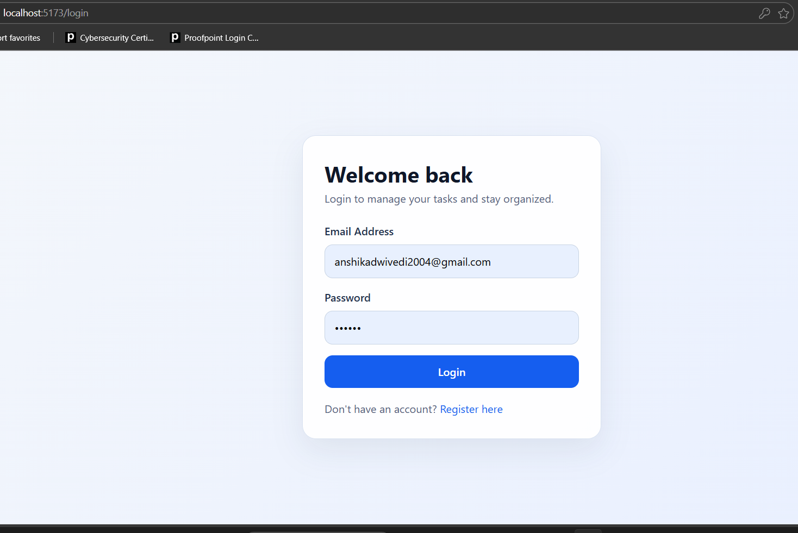
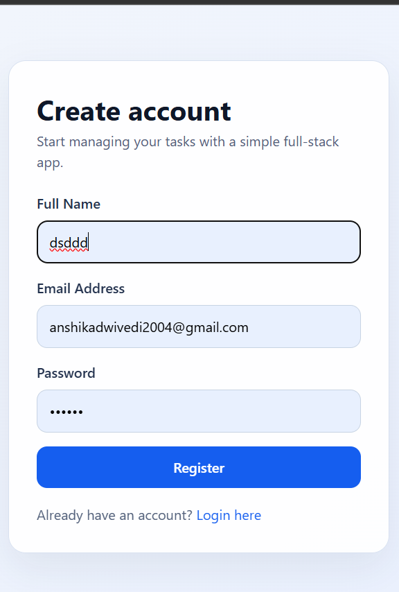
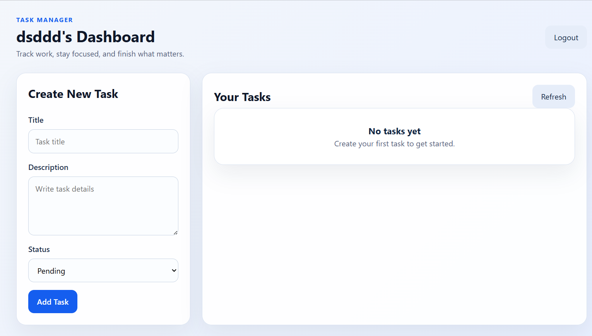

# Task Management Web Application

A beginner-friendly but production-like full-stack Task Management app built with React, Node.js, Express, MongoDB, and JWT authentication.

## Features

- User registration and login with JWT authentication
- Protected routes for authenticated users only
- Create, read, update, and delete tasks
- Task status management with `pending` and `completed`
- Clean and responsive UI using basic CSS
- REST API structure with controllers, routes, models, and middleware

## Tech Stack

- Frontend: React, React Router, Axios, Vite
- Backend: Node.js, Express, JWT, Mongoose
- Database: MongoDB

## Folder Structure

```text
task-management-system/
├── client/
│   ├── public/
│   ├── src/
│   │   ├── api/
│   │   │   └── axiosInstance.js
│   │   ├── components/
│   │   │   ├── AuthForm.jsx
│   │   │   ├── ProtectedRoute.jsx
│   │   │   ├── TaskForm.jsx
│   │   │   └── TaskList.jsx
│   │   ├── context/
│   │   │   └── AuthContext.jsx
│   │   ├── pages/
│   │   │   ├── DashboardPage.jsx
│   │   │   ├── LoginPage.jsx
│   │   │   └── RegisterPage.jsx
│   │   ├── App.jsx
│   │   ├── main.jsx
│   │   └── styles.css
│   ├── .env.example
│   ├── index.html
│   ├── package.json
│   └── vite.config.js
├── server/
│   ├── config/
│   │   └── db.js
│   ├── controllers/
│   │   ├── authController.js
│   │   └── taskController.js
│   ├── middleware/
│   │   └── authMiddleware.js
│   ├── models/
│   │   ├── Task.js
│   │   └── User.js
│   ├── routes/
│   │   ├── authRoutes.js
│   │   └── taskRoutes.js
│   ├── .env.example
│   ├── package.json
│   └── server.js
└── README.md
```

## API Endpoints

- `POST /api/auth/register` register a new user
- `POST /api/auth/login` login and get a token
- `GET /api/auth/me` get the current logged-in user
- `GET /api/tasks` get all tasks for the logged-in user
- `POST /api/tasks` create a new task
- `PUT /api/tasks/:id` update a task
- `DELETE /api/tasks/:id` delete a task

## Setup Instructions

### 1. Backend setup

```bash
cd server
npm install
```

Create `server/.env` using this example:

```env
PORT=5000
MONGO_URI=mongodb://127.0.0.1:27017/task-manager
JWT_SECRET=your_super_secret_jwt_key
CLIENT_URL=http://localhost:5173
```

Run the backend:

```bash
npm run dev
```

### 2. Frontend setup

Open a new terminal:

```bash
cd client
npm install
```

Create `client/.env` using this example:

```env
VITE_API_URL=http://localhost:5000/api
```

Run the frontend:

```bash
npm run dev
```

### 3. MongoDB

Make sure MongoDB is running locally. If you use MongoDB Atlas, replace `MONGO_URI` with your Atlas connection string.

## Beginner-Friendly Notes

- Passwords are hashed before saving
- JWT is passed as `Bearer <token>` in the `Authorization` header
- Auth state is stored in `localStorage`
- The backend uses a clean folder structure for easier learning

## Future Improvements

- Add due dates and priorities
- Add search and filtering
- Add toast notifications
- Add tests
- Deploy the app online

## License

MIT


## 📸 Screenshots




